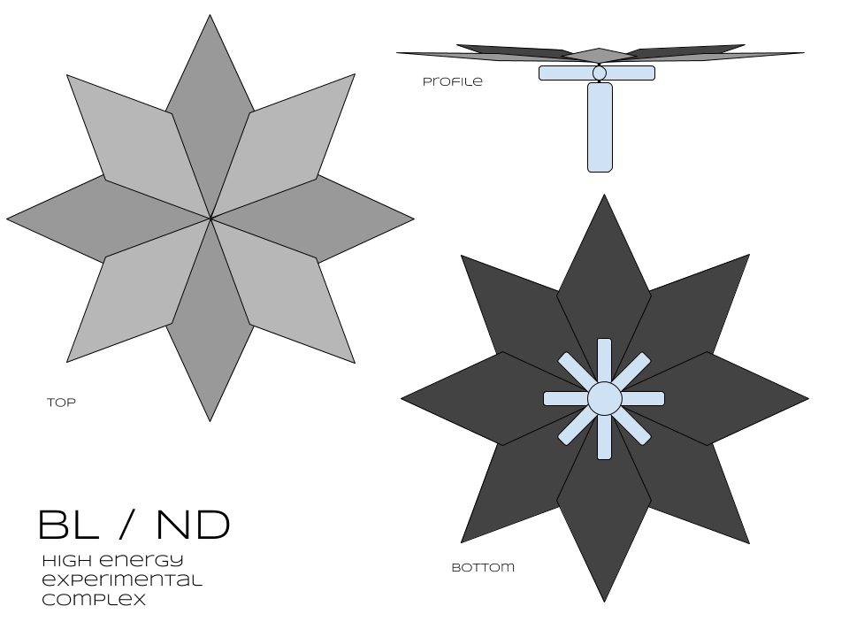

# BL / ND

An adventure that simulates first contact incursions along the lines of media like Annihilation, Blindsight, and Contact.

## Background

In orbit over Mercury the research station owned by the Black Lotus corporation for New Development (Designation: BL / ND) races around the closest planet to the sun using the plentiful energy to power it’s high energy experiments.  

An eight pointed solar array, each leaf a composite of millions of solar panels stretching almost a kilometer from tip to where it’s attached to a central hub, behind which the actual station sits.  A series of eight cylinders arrayed from the same central hub, each at least 100m in length and 10m in diameter make up the main labs and habitable sections. The last section is easily double the size of the other cylinders, the hanger that juts from the central hub like a stalk of some strange metallic plant, turning to face the sun.

The researchers on the station have been working on a recent discovery, an anomalous signal coming from the sun.  

### Player introduction

(To be read to the players in a briefing like manner)

The station has a habit of going silent for days on end.  It's the price paid for having some of the most bleeding edge researchers.  You have to deal with eccentricity. But it's been 17 days since the last check in, and the higher ups are wanting answers.

Polar telescopes have been keeping an eye on the station, but it's been drifting off course, prompting this mission.  Predictions show that within 20 hours the station's orbit will be pushed out of delta V(dV) range of our shuttles. What is strange is that the station should not have the dV for these maneuvers.

Your mission: report the status of the station, secure the facility, and get it back on course.

Prepare for ascent.

## Room One: Entrance and Guardian

The shuttle ferrying you to orbit is going off of trajectories from the last orbit of the station, but as the ship creeks and strains from the growing thermal differentials, a warning pops up.  BL / ND is not where predictions put it. Apoapsis is almost 200km higher than the last predictions, it’s just out of reach.

Getting to the station will take all of the dV the shuttle has, and it will be close even then.  Reporting on this to Mission Control will result in an awkwardly long static silence. Eventually they will be ordered to make the maneuver.  An interstellar shuttle will be rerouted from an inbound trajectory and can rendezvous in 12 hours. Just get the station in a stable orbit.

On approach BL / ND will become visible, an eight pointed solar array, each leaf a composite of millions of solar panels stretching almost a kilometer from tip to where it’s attached to a central hub, behind which the actual station sits.  A series of eight cylinders arrayed from the same central hub, each at least 100m in length and 10m in diameter make up the main labs and habitable sections. The last section is easily double the size of the other cylinders, the hanger that juts from the central hub like a stalk of some strange metallic plant, turning to face the sun.

But as resolution increases with distance something can be seen to be terribly wrong.  There are in fact only 7 Hab modules.  Hab 3 which should be nestled between 2 and 4 is completely gone, only an expanding metallic cloud of shrapnel appearing as it leaves the shade of the array!

The warnings come too late, the shuttle is unable to avoid the cloud of screaming fragments.  It only took a second, but the shuttle is disable, unpowered and out of control!  The Party only has moments to figure out a way to get to BL / ND otherwise they will leave the protective shade of the array and be burnt to a crisp.

Options can include:

* Repairing the power and getting the engines online and try to put the shuttle in orbit near the station.
* Evacuating the shuttle, grabbing whatever supplies they can and make the leap to the station.

Either way, the challenge should come from the damage from the hazard, shrapnel can be sparse still, some EVA suits can be damaged and they have to deal with getting everyone across.  Getting to the station itself should be fraught with danger.

## Room Two: Puzzle or Roleplaying Challenge

Gaining entrance to the actual station is not hard, all airlocks are accessible, either through the service module, or via any of the unrestricted modules.  Once inside the mission should continue as planned, find out what's happened, reestablish control of the situation, and contact Mission Control.

There are several main challenges:

* The station is running on reserve power despite being in the full solar cycle of its orbit.  All of the available power is currently being shunted to HE Lab 2 (Restricted Hab 7). Unless rectified the station will lose power, lights, life support, and station doors will all fail causing the entire station to become hazardous.
* The main communications computer has been damaged, smashed by the look of it.  A competent tech specialist should be able to bring up the communications array on one of the other computers. However all computer commands have been locked out with admin access only being allowed from the HE 2 Lab
* When the party starts poking around the station, a transmission 

## Room Three: Trick or Setback

## Room Four: Climax, Big Battle, or Conflict

HE Lab 2 has 

## Room Five: Reward, Revelation, Plot Twist

## Reference Images

BLND Station

