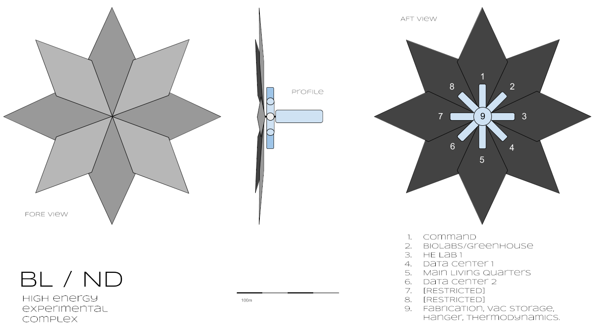

# BL / ND

In orbit over Mercury the research station owned by the Black Lotus corporation for New Development (Designation: BL / ND) races around the closest planet to the sun using the plentiful energy to power it’s high energy experiments.  

The station has a habit of going silent for days on end.  It's the price paid for having some of the most bleeding edge researchers.  You have to deal with eccentricity. But it's been 17 days since the last check in, and the higher ups are wanting answers.

Polar telescopes have been keeping an eye on the station, but it's been drifting off course, prompting this mission.  Predictions show that within 20 hours the station's orbit will be pushed out of dV range of our shuttles. What is strange is that the station should not have the dV for these maneuvers.

Your mission: report the status of the station, secure the facility, and get it back on course.

Prepare for ascent.

## Room One: Entrance and Guardian

## Room Two: Puzzle or Roleplaying Challenge

The shuttle ferrying you to orbit is going off of trajectories from the last orbit of the station, but as the ship creeks and strains from the growing thermal differentials, a warning pops up.  BL / ND is not where predictions put it. Apoapsis is almost 200km higher than the last predictions, it’s just out of reach.

Getting to the station will take all of the dV the shuttle has, and it will be close even then.  Reporting on this to Mission Control will result in an awkwardly long static silence. Eventually they will be ordered to make the maneuver.  An interstellar shuttle will be rerouted from an inbound trajectory and can rendevouz in 12 hours. Just get the station in a stable orbit.

On approach BL / ND will become visible, an eight pointed solar array, each leaf a composite of millions of solar panels stretching almost a kilometer from tip to where it’s attached to a central hub, behind which the actual station sits.  A series of eight cylinders arrayed from the same central hub, each at least 100m in length and 10m in diameter make up the main labs and habitable sections. The last section is easily double the size of the other cylinders, the hanger that juts from the central hub like a stalk of some strange metallic space flower. 

But as resolution increases with distance something can be seen to be terribly wrong.  

## Room Three: Trick or Setback

## Room Four: Climax, Big Battle, or Conflict

## Room Five: Reward, Revelation, Plot Twist

### Reference Images

BLND Station
